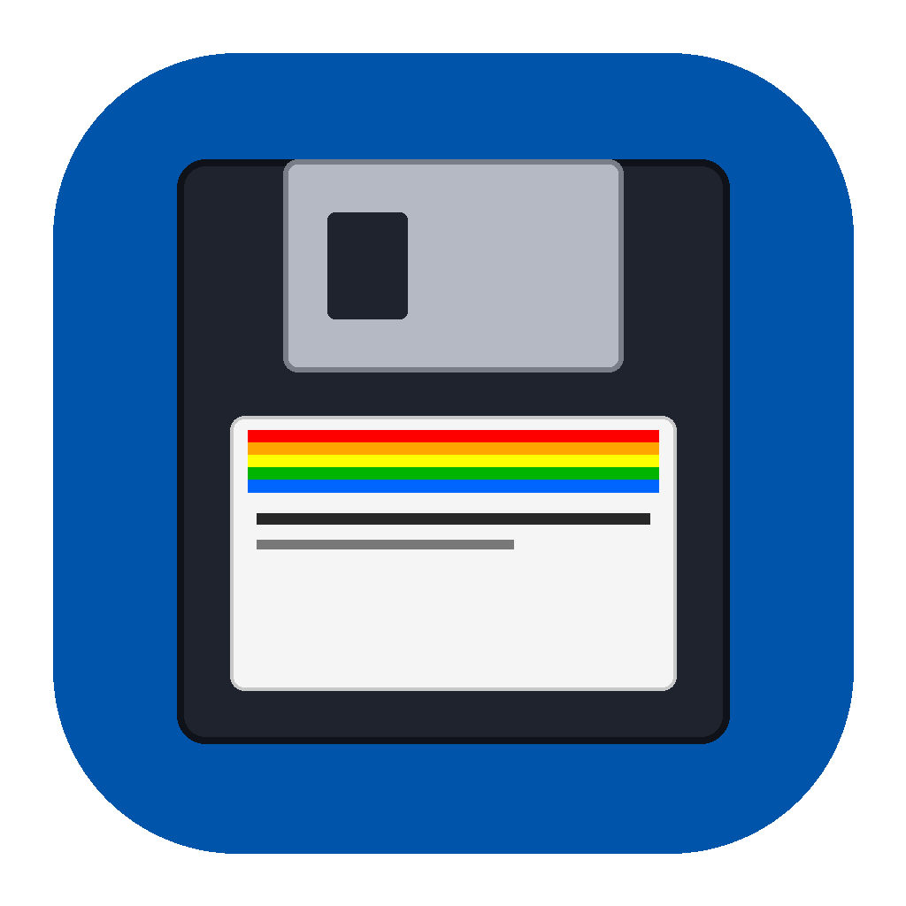

# 🕹️ AmigaLoginScreen

A zero-dependency macOS Droplet and command-line utility that formats and sets classic Commodore Amiga boot screens (or any custom image / animated GIF) as your Mac desktop wallpaper and lock screen.

<p align="center">
  
</p>

---

## ✨ Features

- **Drag-and-Drop Droplet**: Drag any image (`.png`, `.jpg`, `.jpeg`, `.gif`, `.webp`, `.tiff`, `.bmp`, `.heic`) onto the `AmigaLoginScreen.app` icon in Finder or Dock to instantly apply it.
- **Interactive Preset Selector**: Double-clicking the app opens an intuitive picker with built-in presets:
  - 💾 **Kickstart 1.3** (Classic hand holding disk)
  - 🟣 **Kickstart 2.04** (Purple insert-disk screen)
  - 🌈 **Kickstart 3.1** (Rainbow disk screen)
  - 📁 **Custom File Picker**
- **Crisp Retro Pixel Art**: Preserves 1:1 pixel sharpness without blurry bilinear filtering or unwanted stretching.
- **Smart Background Detection**: Automatically samples the corner pixel color (e.g. Amiga Blue `#0055AA`) to pad widescreen displays cleanly.
- **Animated GIF & Multi-Frame Support**: Handles GIF graphics seamlessly.
- **Zero Runtime Dependencies**: Native Mach-O Universal Binary (`arm64` Apple Silicon + `x86_64` Intel Macs). No Python, Homebrew, or external apps required.
- **Lock Screen & Multi-Display Support**: Automatically coordinates with macOS System Events and `NSWorkspace` to apply across displays and the macOS lock screen.

---

## 🚀 Installation & Usage

### Method 1: Droplet (.app)
1. Download `AmigaLoginScreen-1.0.1.dmg` or `.zip` from the [Releases](../releases/) folder.
2. Drag `AmigaLoginScreen.app` to your `/Applications` folder or Desktop.
3. **Usage**:
   - **Quick Apply**: Drag and drop any image/GIF file onto `AmigaLoginScreen.app`.
   - **Interactive Menu**: Double-click `AmigaLoginScreen.app` to select from Kickstart presets or pick a file.

### Method 2: Command-Line (CLI)
You can run the binary directly from Terminal:

```bash
# Show usage and help
./AmigaLoginScreen --help

# Apply a local image or GIF
./AmigaLoginScreen ~/Downloads/my_amiga_art.gif

# Apply an image from URL
./AmigaLoginScreen https://amiga.lychesis.net/applications/Kickstart/Kickstart1.3_2x.png

# Apply a Kickstart preset directly
./AmigaLoginScreen --preset 1.3
./AmigaLoginScreen --preset 2.0
./AmigaLoginScreen --preset 3.1
```

---

## 🛠️ Building from Source

To compile and package the app and release artifacts:

```bash
cd /Volumes/AIWork/code/littlethings/Amiga/Tools/amigaLoginScreen
chmod +x build.sh
./build.sh
```

This compiles universal binaries, generates the `.app` bundle with retro icons, signs the bundle, and outputs release `.dmg` and `.zip` packages to `../releases/`.

---

## 📜 License

MIT License. Commodore Amiga is a trademark of its respective owners. Boot screen graphics provided via [amiga.lychesis.net](https://amiga.lychesis.net).
