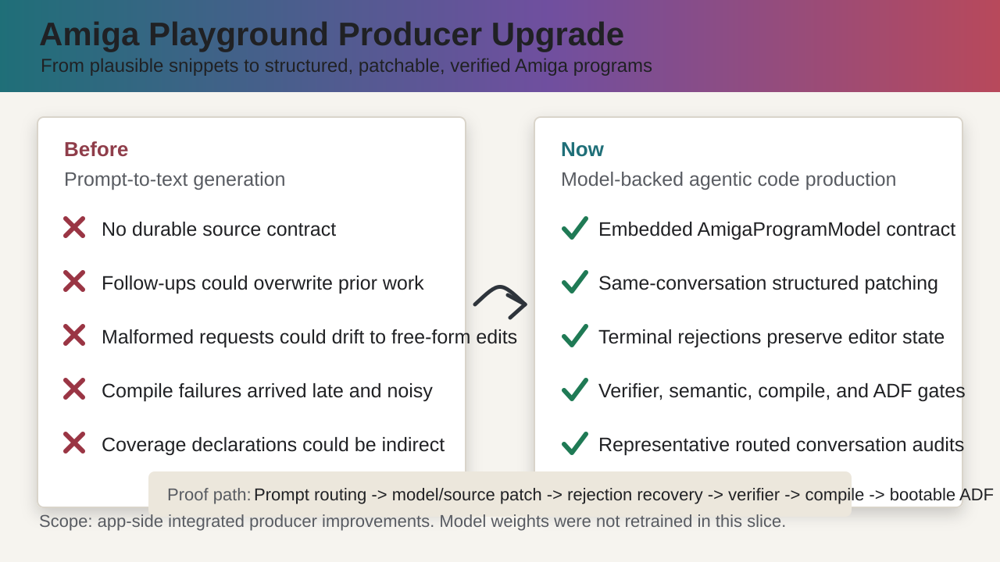

# Agentic Amiga Producer Improvements

Date: 2026-06-15

This summary describes the integrated Amiga Playground producer improvements around the local model. The model weights were not retrained in this slice; the reliability gain comes from a structured program model, deterministic routing, source patching, and promotion gates that surround model-assisted generation.

## Executive Summary

Amiga Playground moved from prompt-to-text generation toward a model-backed Amiga code producer. Supported prompts now route into structured program families that embed an `AmigaProgramModel` in the generated assembly. Follow-up requests patch that model and the owned source regions together, then must pass source verification, semantic checks, compilation, and ADF generation before promotion.

The main user-visible result is continuity. A first prompt can create a coherent MOD player control program, and later same-conversation follow-ups can add, rename, remove, reorder, retarget, and parameterize controls without discarding the existing program state.

## Side-by-Side Comparison

| Area | Before | Now |
| --- | --- | --- |
| Program shape | Generated text snippets could look plausible but had no durable internal contract. | Generated source embeds a canonical `AmigaProgramModel` with family id, kind, controls, routines, state, hardware, and verification expectations. |
| Follow-up behavior | Follow-ups risked rewriting or losing previous controls, routines, state, or setup. | Supported follow-ups patch structured regions and preserve existing model, routine, state, and chip-data payloads unless the edit explicitly supersedes them. |
| MOD controls | The canonical "play and stop MOD file" flow was not a holistic conversation surface. | The MOD family supports adding volume up/down, pause, mute, custom labels, remove, reorder, retarget behavior, bounds edits, initial volume, volume increment, playback period, and playback note. |
| Double-buffered bitplane | The double-buffer prompt could be treated as isolated generated assembly. | The bitplane family is model-backed, with pointer-swap, vblank pacing, buffer copy, front/back color state, and color follow-up coverage. |
| Rejections | Ambiguous or malformed follow-ups could fall through to generic editing. | Recognized structured failures are terminal and leave the editor state unchanged, with concrete reasons for missing values, duplicates, ambiguity, invalid ordinals, or unsupported values. |
| Same-conversation recovery | Recovery after a rejected turn was implicit and easy to regress. | Recovery smoke chains record accepted, rejected, and recovered events, proving the rejected turn does not mutate source/model and the next compatible request continues from the preserved state. |
| Verification | Compile success could be too late and too noisy as a failure signal. | Every routed conversation artifact now passes `AmigaProgramSourceVerifier` before ADF generation, then generates a bootable ADF in the heavy compile gate. |
| Runtime-oriented evidence | Runtime behavior could be inferred from plausible source structure. | Promoted families now declare and pass a default runtime observation contract: double-buffered bitplane requires front/back COLOR01 and BPL pointer swap evidence plus expected-frame visual smoke; MOD controls require Paula AUD0 register writes, DMA enable/stop, and playback-state evidence. Full vAmiga smoke remains optional for ROM-equipped machines. |
| Promotion evidence | Coverage could be declared without representative routed conversation proof. | Manifest audits require representative routed first-shot prompts, accepted follow-up smoke chains, recovery smoke chains, event invariants, embedded model/source checks, and supported-follow-up coverage. |
| Diagnostics | Failures could be broad or indirect. | Artifact names, event prompts, source/model before/after state, and verifier failures point to the exact broken conversation checkpoint. |

## What Changed

- Added model-backed representative routed first-shot coverage for supported families.
- Added multi-step MOD follow-up smoke chains for adding controls, changing labels, moving controls, removing controls, changing behavior, changing bounds, and setting playback parameters.
- Added routed recovery chains for missing playback-period values and duplicate volume-up requests.
- Added event-level audits for routed first-shot conversations, including accepted, rejected, and recovery turns.
- Added invariant checks that every event preserves source/model embedding before and after each follow-up.
- Added checks that rejected turns preserve source and model unchanged.
- Required representative routed accepted coverage for every declared supported follow-up category.
- Added routed first-shot source, pre-rejection setup source, accepted follow-up artifacts, recovery artifacts, and final representative conversation artifacts to the compile/ADF proof set.
- Added per-artifact `AmigaProgramSourceVerifier` assertions before ADF generation.
- Added a required runtime observation contract gate for promoted families, with negative tests for missing bitplane frame-pointer evidence and missing MOD audio-register writes.
- Added outcome caching to keep promotion audits practical while preserving broad coverage.

## Verified Evidence

Recent local verification included:

- `git diff --check`
- `swift test --disable-sandbox --filter 'AmigaPlaygroundTests/testAmigaProgramFamilyPromotionAuditCompilesVerifiedSourcesAndSmokeChains'`
  - Result: passed, 1 test, 0 failures
  - Runtime with the expanded artifact gate: 1011.960 seconds

Previously completed gates in this same improvement stream included:

- representative routed conversation artifact collection,
- accepted and recovery event invariant tests,
- representative supported-follow-up coverage enforcement,
- all-family promotion audit,
- routed first-shot conversation artifact compile checks.

## Practical Impact

The app is now closer to a holistic Amiga code producer than an ad hoc snippet generator. The important distinction is that the source is not just emitted once; it carries a structured contract that future turns can inspect, patch, reject, recover from, and verify.

The model remains useful for broad generation and unsupported requests, but the professional-grade path for promoted families is now:

1. route the prompt to a structured family,
2. generate a model-backed source artifact,
3. patch follow-ups through structured planners,
4. reject unsafe or ambiguous requests without mutation,
5. verify model/source semantics,
6. prove runtime-observable frame or audio state/register evidence,
7. compile and package bootable ADF artifacts.

## Remaining Direction

The goal is still active. The next layers are to broaden family coverage only when it can meet the same manifest, verifier, compile, ADF, rejection/recovery, and runtime-observation standard, and to keep optional emulator smoke available as a higher-confidence check on machines with ROMs and automation access.
