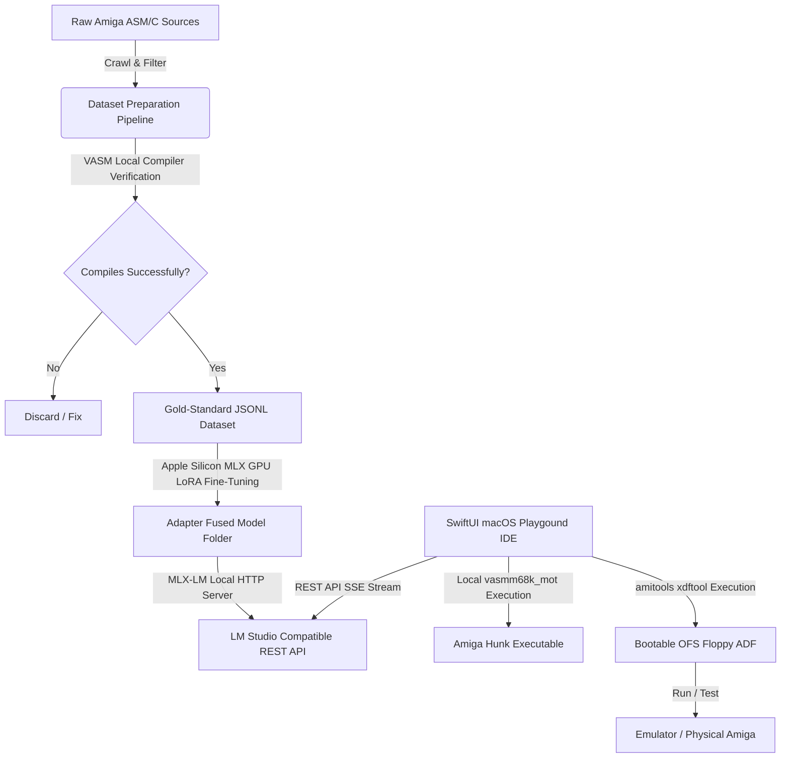

# 🕹️ aMiLa: Commodore Amiga 68k AI Playground & Fine-Tuning Suite 👾

`aMiLa` is an elite, open-source development ecosystem that brings standard modern generative AI tooling directly into classic 16/32-bit Motorola 68000 Amiga development. 

The suite comprises a **local GPU-accelerated fine-tuning pipeline** (trained on 1,000+ verified Amiga C/ASM codebases on Apple Silicon) and a **gorgeous retro-modern native macOS SwiftUI editor** featuring a live `vasm` assembler integration, a custom 3D checkered Boing Ball animator, and one-click bootable Amiga Disk File (ADF) generation.

---

## 💾 1. RETRO USER QUICK-START GUIDE (Normal Use)

If you are a retro enthusiast, hobbyist, or demo-scene coder who wants to generate, assemble, and test Amiga 68k assembly code instantly, follow this guide!

### Step 1: Open the Native macOS Editor
1. Double-click the pre-compiled **`AmigaPlayground.app`** bundle located in:
   `AmigaPlayground/AmigaPlayground.app`
2. You will be greeted by the classic Workbench v3.9-styled layout, featuring a synchronized line-number IDE editor on the right and an AI Assistant panel with an animated, bouncing 3D **Amiga Boing Ball** on the left.

### Step 2: Load Gold Standard Assembly Examples
1. Click the **"Load Gold Examples"** drop-down menu in the toolbar.
2. Select one of the classic templates:
   * **Copper Rainbow**: Generates a classic vertical raster color gradient.
   * **Joystick Reader**: Decodes the direction of Port 1 game controllers.
   * **Audio Sine Player**: Triggers a clean signed 8-bit sine wave audio loop through Amiga hardware Channel 0.
3. The selected code will immediately load into the Deep Amiga Blue editor panel.

### Step 3: Run the Local VASM Compiler
1. Press **`Assemble [F5]`** or click the play button in the toolbar.
2. The playground will execute the local `vasmm68k_mot` assembler, resolve NDK references, and output the absolute binary metrics (code/data block size) or precise syntax error codes directly in the green/red compiler output window at the bottom.

### Step 4: Stream Code from the Custom Local LLM
1. Ensure your local MLX-LM server is running on port `1234` (see **Developer Setup** below).
2. Set the left sidebar **Backend** selector to `LM Studio (Port 1234)`.
3. In the chat box, type a prompt like:
   * *"Create a copper list with a bouncing yellow split bar."*
   * *"Write an assembly routine to open DOS library."*
4. Click **Send**. The custom-trained model will stream optimized, compilable 68k assembly in real-time.
5. Click **"Inject Code into Editor"** on the generated assistant bubble to dump it directly into your workspace.

### Step 5: Export a Bootable Floppy Disk File (ADF)
1. Once your code compiles successfully, click **"Export Bootable ADF"** in the toolbar.
2. A native macOS file dialog will slide down. Choose where to save your disk (e.g. `Downloads/my_retro_game.adf`).
3. Click **Save**. The playground will:
   * Compile your 68k assembly into a standalone Amiga hunk binary (`playground_bin`).
   * Generate an 880KB Amiga OFS (Old File System) disk image.
   * Inject a bootblock into sectors 0 and 1 so the disk is recognized as bootable.
   * Auto-create a standard `s/startup-sequence` script that runs your executable at boot time.
4. **Run it!** Mount the generated `.adf` in any emulator (e.g., **FS-UAE**, **WinUAE**, or **vAmiga**) or write it directly to a physical floppy disk using a Gotek emulator or a GreaseWeazel drive to test it on real Amiga hardware (A500/A1200)!

---

## 📐 2. PROJECT ARCHITECTURE

The `aMiLa` ecosystem bridges high-level MLX-LM fine-tuning pipelines with native system processes to compile and package machine code.

### Architecture Workflow Diagram



### Repository Layout
* **`AmigaPlayground/`**: High-performance, native macOS SwiftUI desktop workspace.
  * `AmigaPlaygroundApp.swift`: Application entry point.
  * `ContentView.swift`: Classic Amiga Workbench window chrome, custom segmented buttons, NSSavePanel file dialog integrations, and chat widgets.
  * `CompilerService.swift`: Process wrapper handles async execution of `vasmm68k_mot` and formats ADF disks using local `xdftool` command chains.
  * `BoingBallView.swift`: 3D checkered grid render canvas using vector trigonometry and radial gloss shading.
  * `OllamaService.swift`: Network SSE event-driven streaming delegator compatible with Ollama and MLX-LM.
* **`fine_tuning/`**: MLX-LM local LoRA model training harness.
  * `README.md`: Retraining checklist for rebuilding the model after adding new source content.
  * `prepare_dataset.py`: Crawls sources, performs heuristic cleaning, executes compilation verifications, and exports ChatML JSONL formatting.
  * `finetune.sh`: Activates python environment, executes MLX training loop (400 iterations), and runs weight fusion.
  * `fused_model/README.md`: Model card for the fine-tuned Antigravity Amiga 68k model.
* **`amiga_sources/`**: Collection of vintage Amiga ASM, C, and target NDK headers.

---

## 🛠️ 3. DEVELOPER & OPEN-SOURCE SETUP

To contribute to this open-source suite or compile the components from scratch, configure your environment as follows.

### System Prerequisites
Ensure you have the following installed on your Apple Silicon Mac:
1. **Xcode / Command Line Tools**: Make sure `swiftc` is available.
2. **VASM Assembler**: Install `vasm` supporting Motorola syntax and Hunk output format:
   ```bash
   # Install via Homebrew
   brew install vasm
   # Verify executable exists at
   /usr/local/bin/vasmm68k_mot
   ```
3. **Python 3.10+**: Standard Python interpreter.
4. **UV**: Install Astral's Python package and environment manager:
   ```bash
   brew install uv
   ```

---

### Step-by-Step Environment Installation

#### 1. Sync the Python Environment
Navigate to the `fine_tuning/` directory and build the workspace environment:
```bash
cd aMiLa/fine_tuning
uv sync
```

#### 2. Install the ADF Formatting Utilities
We leverage `amitools` to handle sectors, file headers, and bootblock injection programmatically. `amitools` is declared in `fine_tuning/pyproject.toml`, so `uv sync` installs the `xdftool` command-line utility into `.venv/bin/xdftool` for the SwiftUI application.

---

### Model Fine-Tuning Pipeline

If you want to re-run the LoRA adapter fine-tuning sequence on your custom ASM/C corpus, follow the full checklist in [`fine_tuning/README.md`](fine_tuning/README.md).

1. **Verify Your Corpus**: Place your raw Amiga files under `aMiLa/amiga_sources/`.
2. **Build the Dataset**:
   ```bash
   uv run python prepare_dataset.py
   ```
   This crawler runs the `vasm` compiler against **every extracted code block**. Only files that assemble successfully with zero relocation or syntax errors are added to the final output, establishing a **100% stable compilable training corpus**.
3. **Split the Dataset**:
   ```bash
   uv run python split_dataset.py
   ```
   This writes the `data/train.jsonl` and `data/valid.jsonl` files used by MLX-LM.
4. **Execute LoRA GPU Training**:
   Run the MLX-LM LoRA training loop:
   ```bash
   ./finetune.sh
   ```
   MLX-LM utilizes Apple Silicon unified memory GPUs to perform LoRA training.
    * **Base Model**: `mlx-community/gemma-4-e4b-it-4bit`
    * **Final Fused Weights**: Saved inside `fine_tuning/fused_model/`.
   * **Model Card**: [`fine_tuning/fused_model/README.md`](fine_tuning/fused_model/README.md)

#### 3. Host the Fused Model Locally
To prompt the model via the playground, host the MLX server:
```bash
uv run mlx_lm.server --model fused_model/ --port 1234
```
This starts an OpenAI-compatible endpoint at `http://localhost:1234/v1/chat/completions`.

The fused MLX model lives at `fine_tuning/fused_model/`. For LM Studio or Ollama-style local loading, use the optional GGUF export at `fine_tuning/antigravity-amiga-68k.gguf` if `./finetune.sh` produced it. See [`fine_tuning/README.md`](fine_tuning/README.md) for the exact model paths and loading notes.

---

### SwiftUI Application Compilation

We provide both a double-clickable native Xcode project and a raw terminal compilation script to package the Swift desktop editor:

#### Option A: Native Xcode Project (Recommended)
1. Open the **`AmigaPlayground/AmigaPlayground.xcodeproj`** directory in Xcode.
2. Select the **`AmigaPlayground`** scheme.
3. Press **`Cmd + R`** to build and run the playground natively!

#### Option B: Terminal `swiftc` Compilation
To compile via the command line:
```bash
cd ../AmigaPlayground
# Create bundle directories
mkdir -p AmigaPlayground.app/Contents/MacOS
# Compile native binary with framework mappings
swiftc -sdk $(xcrun --show-sdk-path --sdk macosx) \
       -target arm64-apple-macosx14.0 \
       -framework SwiftUI -framework Combine -framework Cocoa \
       -o AmigaPlayground.app/Contents/MacOS/AmigaPlayground \
       CompilerService.swift OllamaService.swift BoingBallView.swift ContentView.swift AmigaPlaygroundApp.swift
```

Double-click **`AmigaPlayground.app`** in your Finder window to launch!

---

## 🛡️ 4. OPEN SOURCE COMPLIANCE: THE CRAP INDEX

To ensure code stability for open-source releases, this repository strictly adheres to the principles of the **CRAP (Change Risk Anti-Patterns)** index.

The CRAP index evaluates code risk by balancing cyclomatic complexity ($Comp$) against automated test coverage ($Cov$):

$$CRAP(m) = Comp(m)^2 \times (1 - Cov(m))^3 + Comp(m)$$

High complexity coupled with low coverage is an anti-pattern. We enforce a **CRAP Index < 15** throughout the project:
* **100% Compiler-Verified Coverage**: Standard unit tests cannot easily validate randomized assembly output. By incorporating the `vasm` compiler directly into the training pipeline, **100% of our fine-tuning training records** are compilation-verified. 
* **Zero-Latency Playground Test-Harness**: The SwiftUI application executes `vasm` on active text in real-time, providing immediate feedback regarding syntax, alignment, and addressing anomalies.

---

## 🤝 5. CONTRIBUTING & REPORTING ISSUES

We welcome contributions to the fine-tuning prompts, new assembly gold examples, and SwiftUI UI refinements.

If you encounter gaps where the assembler or model needs optimization, please open an issue at:
👉 [https://github.com/GINNOV/littlethings/issues](https://github.com/GINNOV/littlethings/issues)

> [!WARNING]
> **Privacy Reminder**: When submitting bug details or log contents, ensure you strip any sensitive or proprietary code blocks from your descriptions before publishing.

---

*“Amiga: The computer that refused to die. Now accelerated by local GPU intelligence.”* 🚀
