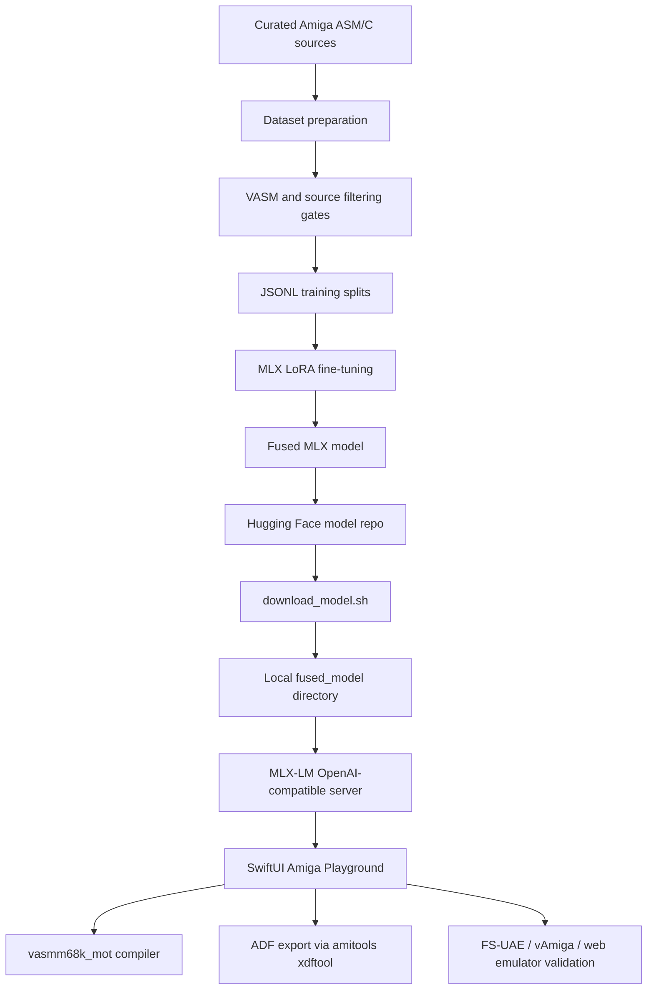

# aMiLa: Commodore Amiga 68k AI Playground & Fine-Tuning Suite

`aMiLa` combines a native macOS SwiftUI playground for Amiga 68k development with a local MLX language-model workflow for generating, checking, fixing, saving, and exporting Motorola 68000 assembly.

The current model artifact is published on Hugging Face at [`bmove/antigravity-amiga-68k`](https://huggingface.co/bmove/antigravity-amiga-68k). Large generated model files are intentionally not stored in GitHub.

---

## Quick Start

### 1. Open The Native macOS Editor

Open the Xcode project:

```bash
open AmigaPlayground/AmigaPlayground.xcodeproj
```

Select the `AmigaPlayground` scheme and run it with `Cmd+R`.

The app provides a split workspace with an AI assistant, source editor, compiler console, emulator views, and toolbar actions for assembly, saving, formatting, chat, and ADF export.

### 2. Download The MLX Model

The fused MLX model is hosted on Hugging Face:

```bash
cd fine_tuning
./download_model.sh
```

By default this downloads `bmove/antigravity-amiga-68k` into:

```text
fine_tuning/fused_model/
```

You can override the source repo:

```bash
HF_MODEL_REPO=bmove/antigravity-amiga-68k ./download_model.sh
```

### 3. Start The Local MLX Server

From the command line:

```bash
cd fine_tuning
uv run python -m mlx_lm.server --model fused_model --port 1234
```

Or use the app's **Settings > Local MLX Server** controls to start, stop, refresh, and inspect the server. The app uses the OpenAI-compatible endpoint:

```text
http://localhost:1234/v1/chat/completions
```

### 4. Generate And Inject Code

In the assistant panel:

- Use `Cmd+Enter` to send a prompt.
- Use **New Chat** to reset the model conversation.
- Use **Prompt Library** to store, search, copy, and paste reusable prompts.
- When injecting assistant code, the app asks for confirmation if the editor already contains code.
- Injected code gets a provenance header containing user, date/time, proposed file name, and prompt.
- Injection plays a short sound cue.

Useful prompts:

```text
Create a copper list with a bouncing yellow split bar.
Write a VASM-compatible Motorola 68000 routine that waits for vertical blank.
Fix the assembler errors below and comment each amended line.
```

### 5. Assemble, Fix, Format, Save, And Export

The toolbar and **Playground** menu expose the main editor workflow:

- **Assemble** (`Cmd+R`): runs `vasmm68k_mot` and switches to the Console tab.
- **Fix Compile Errors with Assistant** (`Cmd+Option+F`): sends assembler errors back to the assistant for targeted repair.
- **Save Code...** (`Cmd+S`): saves the current editor source.
- **Indent Code** (`Cmd+Option+I`): formats assembly/C source with vasm-oriented indentation.
- **Export Bootable ADF...**: builds an Amiga executable and writes an 880 KB OFS `.adf`.
- **Run Default Emulator**, **Validate with vAmiga**, and **Run Web Emulator**: launch available emulator validation paths.

---

## Project Architecture



### Repository Layout

- `AmigaPlayground/`: native macOS SwiftUI app.
- `AmigaPlayground/App/`: app entry point and macOS scenes.
- `AmigaPlayground/Views/`: main editor UI, prompt library, Boing Ball view, and web emulator view.
- `AmigaPlayground/Services/`: compiler, assistant streaming, prompt storage, MLX server control, emulator launching, and vAmiga validation services.
- `AmigaPlayground/AmigaPlaygroundTests/`: unit tests for compiler, ADF, streaming, prompt library, MLX server invocation, and related services.
- `fine_tuning/`: MLX-LoRA training, dataset preparation, model download helper, and local generated model output.
- `Dataset/`: local source corpora. Some nested corpus directories are independent Git working trees.

Generated artifacts ignored by Git include:

- `aMiLa/fine_tuning/adapters/`
- `aMiLa/fine_tuning/fused_model/`
- `aMiLa/fine_tuning/*.gguf`
- `aMiLa/fine_tuning/server.log`
- `aMiLa/Dataset/corpus1/corpus_manifest.jsonl`

---

## Developer Setup

### Prerequisites

- Xcode and macOS Command Line Tools
- `vasmm68k_mot` with Motorola syntax and hunk output support
- Python 3.10+
- `uv`
- Hugging Face CLI (`hf`) for model download/upload

Install common dependencies:

```bash
brew install uv
```

Install or build `vasm` according to your local toolchain. The app expects to find `vasmm68k_mot` in a standard executable path.

### Python Environment

```bash
cd fine_tuning
uv sync
```

`uv sync` installs the Python tooling used by MLX-LM and the `amitools`/`xdftool` path used by the app for ADF generation.

### Build The App

Recommended:

```bash
xcodebuild \
  -project AmigaPlayground/AmigaPlayground.xcodeproj \
  -scheme AmigaPlayground \
  -destination 'platform=macOS' \
  build
```

The most recent verification was a successful macOS Xcode build after the Hugging Face/model cleanup.

---

## Fine-Tuning Workflow

The detailed retraining checklist lives in [`fine_tuning/README.md`](fine_tuning/README.md).

High-level flow:

```bash
cd fine_tuning
uv sync
uv run python prepare_dataset.py
uv run python split_dataset.py
./finetune.sh
```

Current published model:

- Model repo: [`bmove/antigravity-amiga-68k`](https://huggingface.co/bmove/antigravity-amiga-68k)
- Base model: `mlx-community/gemma-4-e4b-it-4bit`
- Format: MLX fused checkpoint with LoRA adapter checkpoints also uploaded
- Training length documented on the model card: 1,500 iterations
- License metadata: Apache 2.0
- Hub tags include: `mlx`, `m68k`, `assembly`, `retrocomputing`, `amiga`, `c`, `vasm`

When regenerated, publish model artifacts to Hugging Face and keep GitHub limited to source code, scripts, app code, and lightweight metadata.

---

## Recommended Assembly System Prompt

```text
You are AntigravityAmiga, an elite Amiga 68000 Motorola assembly programmer.
Write highly optimized, clean, and 100% compilable Motorola 68k assembly code.

CRITICAL DIRECTIVES:
- DO NOT leak C-style preprocessor directives (#define, #include, #ifdef) into assembly code.
- DO NOT use C-style comments (// or /* */). All assembly comments MUST start with a semicolon (;).
- Use VASM-compatible include statements, for example: include "exec/types.i".
- Ensure directives such as SECTION, MOVE, DC, DS, and RTS have leading spaces when needed so they are not treated as compiler labels.
- When amending code from an assembler error log, change only the lines needed and add semicolon comments on the amended lines explaining the correction.
```

---

## Contributing

Useful contributions include:

- New reviewed Amiga assembly/C examples.
- Compiler-error repair prompt examples.
- Prompt library entries.
- SwiftUI workflow refinements.
- Emulator validation improvements.

Open issues in the parent repository:

<https://github.com/GINNOV/littlethings/issues>

When reporting bugs, strip proprietary code and any sensitive local paths or tokens from logs before posting.
