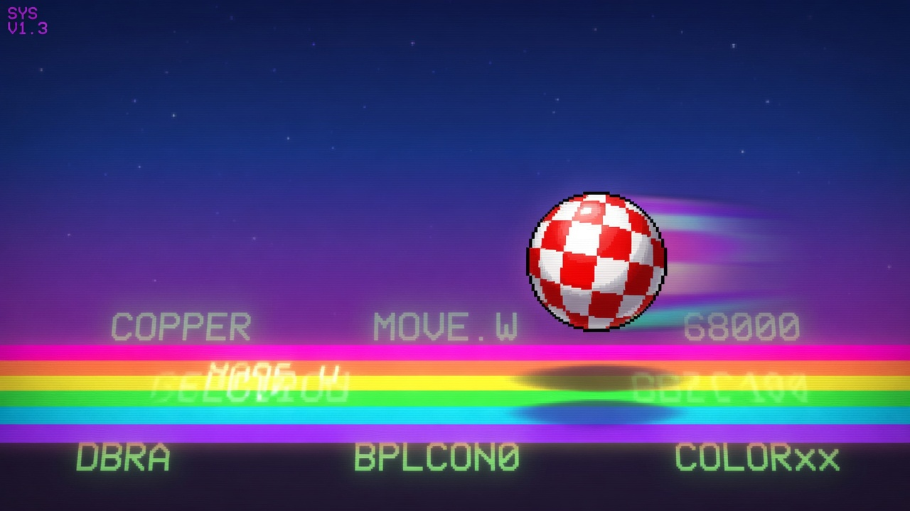

<div align="center">

# 🕹️ Amiga Playground ASM

### Local Apple Silicon LoRA that writes Motorola 68000 Amiga assembly which *actually assembles*

[](https://huggingface.co/bmove/amiga-playground-asm)
[](https://huggingface.co/mlx-community/Qwen2.5-Coder-3B-Instruct-4bit)
[](https://github.com/ml-explore/mlx-lm)
[](https://www.apache.org/licenses/LICENSE-2.0)

[Amiga Playground app](https://ginnov.github.io/littlethings/amiga/index.html) ·
[Source](https://github.com/GINNOV/littlethings/tree/master/Amiga/aMiLa) ·
[Issues](https://github.com/GINNOV/littlethings/issues)



</div>

---

## What this is

**Amiga Playground ASM** is a small, focused **MLX LoRA adapter** on top of
[`mlx-community/Qwen2.5-Coder-3B-Instruct-4bit`](https://huggingface.co/mlx-community/Qwen2.5-Coder-3B-Instruct-4bit).
It is the product model behind **[Amiga Playground](https://ginnov.github.io/littlethings/amiga/index.html)** —
a native macOS workspace for writing, generating, assembling, and testing Commodore Amiga 68k code.

Ask it for a copper list, a blitter clear, a Paula DMA player, a bootblock skeleton…
get **Motorola syntax** meant to assemble under:

```bash
vasmm68k_mot -m68000 -Fhunkexe
```

> **Headliner result:** **140 / 140** first-shot sealed compile on 7 Amiga ASM families
> (20 variants each), temperature `0`. Compile-gate only — not a full hardware-semantic
> or emulator-ladder guarantee.

**New to ML?** Jump to [How it was trained (for curious non-ML people)](#how-it-was-trained-for-curious-non-ml-people)
for a plain-language tour of the corpus, LoRA, and compile-gate scoring.


<p align="center"><em>Amiga Playground: editor, local assistant, vasm console, ADF export, emulator launch.</em></p>

---

## Quick facts

| | |
|--|--|
| **Model id** | `amiga-playground-asm` |
| **Product / version** | Amiga Playground ASM **0.1.0** |
| **Kind** | LoRA adapter (MLX) — not a full base checkpoint |
| **Base** | `mlx-community/Qwen2.5-Coder-3B-Instruct-4bit` |
| **Adapter size** | ~26 MB (`adapters.safetensors`) |
| **LoRA** | rank **8**, scale **20**, **16** layers, dropout **0** |
| **Target CPU** | Motorola **68000** / Amiga OCS-era idioms |
| **Assembler gate** | `vasmm68k_mot -m68000 -Fhunkexe` |
| **Adapter SHA256** | `3c6cadccd24af796bcb9f6a8a3677539e764709abe982dce4c4f7be9ee6cf88a` |
| **Runtime layout** | `runtime/base` + `runtime/adapter` (via app / scripts) |

---

## Evaluation — sealed first-shot compile

Harness: `minimal_sealed_asm.py` against frozen benchmark
`amila-tier1-promotion-v1` (ASM subset).

| Setting | Value |
|---------|-------|
| Mode | **First-shot** (no repair loop) |
| Temperature | **0** |
| Gate | `vasmm68k_mot -m68000 -Fhunkexe` |
| Pass threshold per family | 18 / 20 |
| Result | **140 / 140** (all 7 families green) |

### Families (20 cases each)

| Family | What it exercises |
|--------|-------------------|
| `minimal_executable` | Valid HUNK sections + clean entry/return |
| `bootblock_skeleton` | 1024-byte checksum-ready bootblock layout |
| `blitter_clear` | Blitter idle wait, masks, modulo, size |
| `bitplane_display` | OCS bitplanes + copper + deterministic cleanup |
| `cia_input` | CIA-A polling without clobbering DDR bits |
| `keyboard_polling` | Serial key decode + CIA handshake |
| `audio_dma` | Paula channel DMA + explicit stop path |

**What this measures:** the model emits Motorola 68000 that **assembles and links to a HUNK executable** on the first try.

**What this does *not* measure:** cycle-accurate hardware behavior, full demo-scene correctness, or multi-file projects. Emulator / runtime ladders are a separate gate.

---

## Intended use

| ✅ Good fit | ❌ Not the goal |
|------------|----------------|
| Local Amiga Playground assistant | Cloud-only hosted inference |
| Copper / blitter / CIA / Paula sketches | Full OS multitasking apps |
| Teaching / sketching 68k Amiga idioms | Guaranteed runtime-correct demos |
| Apple Silicon MLX offline workflow | Replacing a human Amiga coder |

Primary consumers:

1. **[Amiga Playground](https://ginnov.github.io/littlethings/amiga/index.html)** (macOS) — in-app MLX or OpenAI-compatible server on port `1234`
2. **MLX-LM** scripts that load base + this adapter

---

## Install with Amiga Playground

```bash
cd aMiLa/fine_tuning
uv sync
./download_model.sh   # runtime/base + runtime/adapter
./deploy.sh           # OpenAI-compatible server on :1234
```

In the app:

- Provider: **LM Studio (Port 1234)** *(or in-app MLX Start)*
- Model id: **`amiga-playground-asm`**

Manual server:

```bash
uv run python serve_playground.py --port 1234
# → http://localhost:1234/v1/chat/completions
```

### Example request

```bash
curl http://localhost:1234/v1/chat/completions \
  -H "Content-Type: application/json" \
  -d '{
    "model": "amiga-playground-asm",
    "temperature": 0,
    "messages": [
      {
        "role": "user",
        "content": "Create a CIA-A input polling routine for an active-low control signal. Return one Motorola 68000 source file for a real Amiga target."
      }
    ]
  }'
```

### Load adapter yourself (MLX)

```python
from mlx_lm import load, generate

model, tokenizer = load(
    "mlx-community/Qwen2.5-Coder-3B-Instruct-4bit",
    adapter_path="path/to/adapters",  # this repo's adapters/
)

prompt = (
    "Create a minimal Amiga HUNK executable that enters and returns cleanly. "
    "Return one source file for a real 68000 Amiga target."
)
messages = [{"role": "user", "content": prompt}]
text = tokenizer.apply_chat_template(
    messages, tokenize=False, add_generation_prompt=True
)
print(generate(model, tokenizer, prompt=text, max_tokens=1024))
```

---

## Prompting tips

The sealed harness uses **capability prompts** like the ones below. Prefer:

- One **complete source file**
- **Motorola** syntax (vasm `mot` dialect)
- Explicit **cleanup / restore** when touching custom chips
- Real **68000 / OCS** constraints (no hypothetical 64-bit Amiga fantasy)

### Prompt starters

<details>
<summary><b>Minimal HUNK executable</b></summary>

```
Create a minimal Amiga HUNK executable that enters and returns cleanly.
The implementation must construct valid sections and an exported entry point.
Return one source file for a real 68000 Amiga target.
```
</details>

<details>
<summary><b>Copper + bitplanes</b></summary>

```
Create an OCS bitplane display setup with a copper list and cleanup path.
The implementation must configure display fetch, DMA, and restoration deterministically.
Return one source file for a real 68000 Amiga target.
```
</details>

<details>
<summary><b>Blitter clear</b></summary>

```
Create a routine that clears a bounded planar region with the Amiga blitter.
The implementation must wait for blitter idle and program masks, modulo, and size safely.
Return one source file for a real 68000 Amiga target.
```
</details>

<details>
<summary><b>Paula audio DMA</b></summary>

```
Create a single-channel Paula DMA playback routine with an explicit stop path.
The implementation must program aligned sample location, length, period, volume,
and DMA ownership. Return one source file for a real 68000 Amiga target.
```
</details>

<details>
<summary><b>Bootblock skeleton</b></summary>

```
Create a checksum-ready 1024-byte bootblock skeleton with a valid entry.
The implementation must preserve the boot ABI and bounded block layout.
Return one source file for a real 68000 Amiga target.
```
</details>

---

## Files in this repo

```text
adapters/
  adapters.safetensors   # LoRA weights (~26 MB)
  adapter_config.json    # rank / scale / base / product metadata
model_version.json       # product id, version, eval summary, SHA256
README.md                # this card
assets/
  banner.jpg             # hero art
  amiga-playground.png   # app screenshot
```

You still need the **base** MLX model separately
(`mlx-community/Qwen2.5-Coder-3B-Instruct-4bit`).
`download_model.sh` in the app tree fetches both.

---

## How it was trained (for curious non-ML people)

This section is intentionally plain-language. If you already know fine-tuning,
skim the tables; if you don't, read it top-to-bottom.

### The 30-second version

1. Start from a small **coding model** that already understands English + code
   (Qwen2.5-Coder-3B, 4-bit MLX build for Apple Silicon).
2. Gather a lot of **real Amiga source** (tutorials, demos, tools, Aminet packages).
3. **Filter hard**: prefer readable, licensed, teaching-oriented material; skip
   binaries, ROMs, disk images, and junk.
4. Where possible, only keep assembly that **`vasm` can assemble** — broken syntax
   should not teach the model.
5. Turn accepted snippets into **chat-style examples**
   (*user asks for a routine → assistant answers with Motorola 68000 source*).
6. Train a tiny **LoRA adapter** on top of the base model (not a whole new model).
7. Score the result with a **sealed first-shot compile harness** (140/140).
8. Ship only the adapter (~26 MB). Users still download the public base model.

### Vocabulary (no jargon left unexplained)

| Term | What it means here |
|------|--------------------|
| **Base model** | The general coding brain we start from. It already knows many languages; it is *not* Amiga-specialized yet. |
| **Fine-tuning** | A second training phase where we show the model Amiga-specific examples so it picks up 68k / copper / blitter idioms. |
| **LoRA (Low-Rank Adaptation)** | Instead of rewriting all billions of weights, we train a small set of “sticky notes” (adapter matrices) that sit on top of the base model. Result: small file, cheap to train, easy to distribute. |
| **Adapter** | The sticky notes: `adapters.safetensors` in this repo. |
| **MLX** | Apple’s machine-learning stack for Apple Silicon. Training and serving happen locally on a Mac GPU. |
| **4-bit / quantized** | The base model is stored with fewer bits per weight so it fits in laptop memory. Quality tradeoff is usually small for coding assistants. |
| **ChatML / chat examples** | Training rows look like a conversation: a user prompt + the desired assistant reply (assembly source). |
| **Compile gate** | Automated check: does generated ASM assemble with `vasmm68k_mot -m68000 -Fhunkexe`? Yes/no. |
| **First-shot** | One generation attempt, no “please fix the errors” loop. Harder and more honest. |
| **Sealed harness** | Frozen prompts + seeds + temperature 0, so scores are comparable across runs. |
| **Corpus** | The big pile of source files used as raw material for training examples. |
| **Training tier** | How eagerly we include a project: Tier 1 = teach first; Tier 4 = sample carefully. |

### Architecture of the product

```text
┌──────────────────────────────┐
│  Public base model (HF)      │  mlx-community/Qwen2.5-Coder-3B-Instruct-4bit
└──────────────┬───────────────┘
               │  + LoRA adapter (this repo)
               ▼
┌──────────────────────────────┐
│  Local MLX server :1234      │  model id: amiga-playground-asm
└──────────────┬───────────────┘
               │  chat completions
               ▼
┌──────────────────────────────┐
│  Amiga Playground (macOS)    │  editor → vasm → ADF → emulator
└──────────────────────────────┘
```

You never need the training corpus to *use* the model. Corpus + prep scripts are
for people who want to understand or rebuild.

### Pipeline end-to-end

```text
 public Amiga sources          prepare / filter           train                ship
 ─────────────────────         ────────────────           ─────                ────
 GitHub curated repos  ──┐
 Aminet dev/c, dev/asm ──┼──► keep source files ──► Chat examples ──► LoRA ──► adapters.safetensors
 Learning / demo trees ──┘    drop binaries/ROMs      (prompt→ASM)     on Mac     + model_version.json
                              prefer vasm-clean
                                    │
                                    ▼
                           sealed scoreboard
                           140/140 first-shot
```

Historically the aMiLa tree described this loop as:

1. **`prepare_dataset.py`** — crawl sources, clean, optionally compile-check, emit ChatML JSONL  
2. **`split_dataset.py`** — train / valid split  
3. **`finetune.sh`** — MLX-LM LoRA training on Apple Silicon, then package adapter  
4. **`minimal_sealed_asm.py`** — frozen first-shot compile scoreboard (still present under `fine_tuning/tools/`)

The **shipped artifact** is only the adapter + metadata. The base weights stay on
the public Hub (`mlx-community/...`).

### Where the corpus comes from

The aMiLa dataset work is layered. Think of it as three shelves of books, not one
mysterious dump.

#### Shelf A — GitHub + curated high-signal repos (`Dataset/corpus1`)

A corpus builder (`fetch_amiga_corpus.py`) pulls **public** Amiga-related source:

| Source | Role |
|--------|------|
| **GitHub search** | Queries such as `amiga language:assembly`, `m68k`, `blitter amiga copper`, `paula audio`, `topic:amiga`, demo/game sources, toolchains, etc. |
| **Curated repos** | Hand-picked trees (examples, demos, toolchains, libraries) kept under `curated/` |
| **Aminet / GitLab** | Additional public trees when enabled |

**Only source-like files are kept**, for example:

- C/C++: `.c`, `.h`, `.cpp`, …  
- Assembly: `.s`, `.asm`, `.i`, `.inc`, …  
- Docs that often carry examples: `.readme`, `.guide`  
- Build files used as context: Makefiles  

Binaries and huge repos are skipped (e.g. repo size cap around **500 MB** in the fetcher).  
Each kept file can be listed in a **manifest** (`corpus_manifest.jsonl`) with path,
language hint, size, and text — ready for later packaging into training rows.

Curated examples on disk include projects such as demoscene trees, AROS references,
`amitools`, `vbcc`, `amissl`, and other well-known Amiga-adjacent codebases
(full list lives in the fetcher’s `CURATED_REPOS`).

#### Shelf B — Aminet developer archives (`Dataset/corpus2`)

A mirror pass over classic Aminet developer categories:

| Field | Snapshot value |
|-------|----------------|
| Mirror | `ftp.aminet.net` |
| Categories | `dev/src`, `dev/c`, `dev/asm` |
| C sources retained | **12,646** files · ~**3.35M** lines |
| Assembly retained | **3,658** files · ~**1.66M** lines |
| Docs retained | **7,125** files |
| Packages processed | **958** (some extractions failed and were skipped) |
| Dedup | SHA-256 · **22,471** unique hashes · **2,668** duplicate blobs skipped |

This shelf is the “historical public Amiga developer archive” layer: lots of real
hardware and OS code, uneven quality, valuable when sampled carefully.

#### Shelf C — Catalogued local `amiga_sources` tree (`Dataset/corpus3`)

A **human-oriented inventory** (~75 projects) with explicit training policy:

| training_tier | Meaning | Count in catalog |
|---------------|---------|------------------|
| **1** | Curated learning material — use first | 18 |
| **2** | Compact runnable projects / demos | 18 |
| **3** | Libraries, tools, moderate apps — sample | 27 |
| **4** | Large apps / ports — targeted use only | 12 |

Categories include `learning`, `asm-demos`, `c-examples`, `games`, `applications`,
`tools`, `libraries`, `toolchains`, `reference`.

**Tier 1 examples** (preferred teaching material):  
`amiga-assembler`, `amiga-c`, `amiga-c-tutorials`, `amiga-examples`,
`amiga-hardware-in-c`, `amiga-game-prog`, `amiga-playground`, `hello-bars`,
`misc-asm-68k-amiga-ocs`, copper/rainbow-style tutorials, etc.

### Training policy (what we try *not* to teach)

From `catalog/training-policy.md` — the philosophy is:

> Teach Amiga programming concepts. Do **not** blindly maximize tokens.

**Include first:** small tutorials and idiomatic examples (68k basics, AmigaOS
calls, hardware registers, Copper/display, buildable snippets).

**Add second:** compact demos/games/utilities with a README or Makefile.

**Sample carefully:** huge toolchains, NDKs, large application archives — take
headers/examples/READMEs before whole trees.

**Exclude by default:**

- Binaries and archives used as blobs: `*.o`, `*.exe`, `*.adf`, `*.lha`, …  
- Generated parser/compiler noise  
- Screenshots, sprites, music modules, packed assets  
- **ROMs / Kickstart / firmware** (legal + useless as “code style” teachers)  
- Duplicate vendor drops of the same upstream  
- Build/cache folders  

**Attribution:** keep README/LICENSE with projects; training records should carry
project path, category, tier, and license/readme presence when packaged.

### From “pile of files” to “model that answers prompts”

Raw files are not what the GPU trains on directly. The prep idea is:

1. **Read** a source file (or a coherent block inside it).  
2. **Optionally assemble** it with `vasm`. If it cannot assemble, it is a weak
   teacher for a compile-first assistant — prefer drop or repair.  
3. **Build a chat example**, roughly:

   ```text
   User: Create a CIA-A input polling routine for an active-low control signal.
         Return one source file for a real 68000 Amiga target.
   Assistant:
     ; motorola 68000 ...
           SECTION Code,CODE
     ...
   ```

4. Write many such pairs to **JSONL** (`train.jsonl` / `valid.jsonl` style).  
5. Fine-tune with **MLX-LM LoRA** so the model practices:  
   *English hardware intent → Motorola syntax that vasm likes.*

That is why the public product feels “compile-first”: the training objective was
never “sound like an Amiga forum,” it was “emit assembler the toolchains accept.”

### What exactly is inside *this* adapter

From `adapter_config.json` / `model_version.json`:

| Setting | Value | Plain English |
|---------|-------|----------------|
| Fine-tune type | LoRA | Small adapter, not full retrain |
| Base | `mlx-community/Qwen2.5-Coder-3B-Instruct-4bit` | Starting brain |
| Layers adapted | **16** | How many transformer blocks get sticky notes |
| LoRA rank | **8** | Capacity of the sticky notes (small = focused) |
| LoRA scale | **20** | How strongly the adapter influences the base |
| Dropout | **0** | No random “ignore adapter” during training for this package |
| Product version | **0.1.0** | First productized compile-gate release |
| Adapter SHA256 | `3c6cad…f88a` | Integrity pin for the shipped weights |

**Why so small?**  
A rank-8 LoRA on a 3B model is intentionally narrow: good at a dialect
(Motorola Amiga ASM idioms), cheap to ship, unlikely to fully “replace” the base
model’s general coding skill. If something is outside the Amiga ASM lane, the
base model still does most of the talking.

### How we know it works (evaluation you can re-run)

Training loss alone is a weak story for assembly. The product gate is mechanical:

```bash
cd aMiLa/fine_tuning
uv run python tools/minimal_sealed_asm.py \
  --adapter runtime/adapter \
  --output-dir /tmp/asm-score \
  --limit 0 --compile-backend both
```

| Rule | Detail |
|------|--------|
| Benchmark | `amila-tier1-promotion-v1` (ASM subset) |
| Cases | **140** = 7 families × 20 variants |
| Decoding | temperature **0**, fixed seeds per case |
| Pass | `vasmm68k_mot -m68000 -Fhunkexe` succeeds |
| Family bar | ≥ **18/20** (critical: not 0/20) |
| Shipped score | **140/140** |

Families (again, because this *is* the curriculum the scoreboard cares about):

1. Minimal HUNK executable  
2. Bootblock skeleton  
3. Blitter clear  
4. Bitplane display + copper + cleanup  
5. CIA input  
6. Keyboard polling + handshake  
7. Paula audio DMA + stop path  

**Honest scope:** this proves *syntax + linkable hunk structure under vasm*, not
“looks perfect in every demo on real A500 copper timing.” Emulator / semantic
ladders are separate ambition layers in Amiga Playground.

### What this is *not*

- Not a full fine-tune of a new foundation model from scratch  
- Not trained on Kickstart ROMs or commercial game binaries as opaque blobs  
- Not a guarantee of cycle-accurate or demo-party-winning code  
- Not multi-file project synthesis (single complete source file bias)  
- Not a cloud API — designed for **local** Apple Silicon + the Playground app  

### If you want to go deeper

| Resource | What you’ll find |
|----------|------------------|
| [Amiga Playground on the site](https://ginnov.github.io/littlethings/amiga/index.html) | Product context, install path |
| [`GINNOV/littlethings` → `Amiga/aMiLa`](https://github.com/GINNOV/littlethings/tree/master/Amiga/aMiLa) | App + fine_tuning runtime + dataset notes |
| `Dataset/corpus3/catalog/training-policy.md` | Inclusion / exclusion rules in full |
| `Dataset/corpus3/catalog/projects.tsv` | Per-project tier & category |
| `fine_tuning/tools/minimal_sealed_asm.py` | The actual scoreboard |
| [MLX-LM](https://github.com/ml-explore/mlx-lm) | How LoRA training/serving works on Apple Silicon |
| [Qwen2.5-Coder](https://huggingface.co/Qwen/Qwen2.5-Coder-3B-Instruct) | The base model family |

### Mental model for learners

Imagine a talented junior who already codes in many languages (the **base model**).
You give them a focused internship on Amiga 68000 sources (**corpus + LoRA**),
then a written exam where every answer must compile with the real assembler
(**sealed harness**). This Hub repo is the internship notebook they keep —
not their entire brain.

---

## Limitations & safety

- **Compile-gate ≠ hardware truth.** Passing `vasm` does not prove copper timing, blitter safety in every scene, or legal ROM usage.
- **Single-file bias.** Multi-module projects, linker scripts, and full games are out of scope for v0.1.
- **OCS / 68000 focus.** AGA, 68020+ ISAs, and modern cross-dev C toolchains are not the sealed target.
- **Local weights.** This repo is an adapter; respect the base model license as well as Apache-2.0 on the adapter packaging.
- **No Kickstart redistribution.** You must supply legally obtained ROMs for emulators yourself.

---

## Citation

```bibtex
@misc{amiga-playground-asm,
  title        = {Amiga Playground ASM: MLX LoRA for Motorola 68000 Amiga assembly},
  author       = {bmove / GINNOV},
  year         = {2026},
  howpublished = {\url{https://huggingface.co/bmove/amiga-playground-asm}},
  note         = {LoRA adapter on mlx-community/Qwen2.5-Coder-3B-Instruct-4bit; 140/140 sealed first-shot compile}
}
```

---

<div align="center">

*“Amiga: the computer that refused to die. Now with a local LoRA that speaks 68000.”*

**Product model for [Amiga Playground](https://ginnov.github.io/littlethings/amiga/index.html)** · build lineage ships with app **1.0.0+**

</div>
