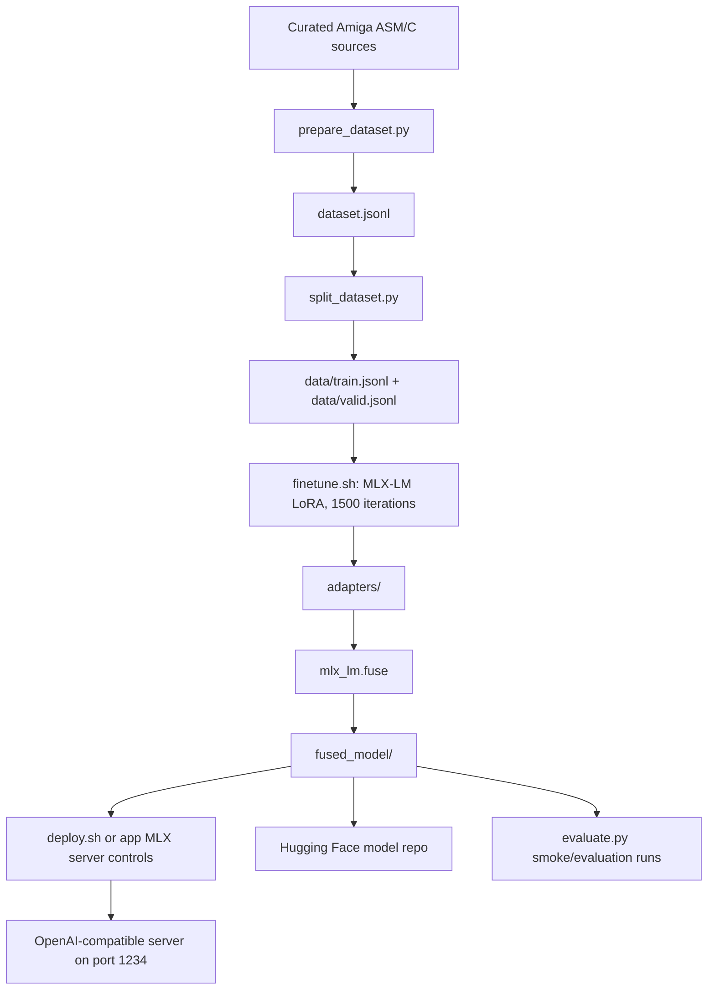

# Antigravity Amiga 68k Fine-Tuning Walkthrough

This walkthrough describes the current local MLX fine-tuning, serving, evaluation, and publishing workflow for the Antigravity Amiga 68k model.

The published model artifact lives on Hugging Face:

```text
https://huggingface.co/bmove/antigravity-amiga-68k
```

Large generated artifacts such as `fused_model/`, `adapters/`, optional `.gguf` files, and `server.log` are intentionally ignored by GitHub.

---

## 1. Pipeline Architecture



---

## 2. Component Walkthrough

### Data Curation: `prepare_dataset.py`

`prepare_dataset.py` builds the supervised fine-tuning dataset from local Amiga-oriented source material.

Current behavior:

- scans candidate source files,
- filters unsuitable or noisy material,
- validates supported assembly candidates with `vasmm68k_mot`,
- writes the generated supervised dataset to `dataset.jsonl`.

The current checked-in local dataset has 200 records:

```text
dataset.jsonl       200 records
data/train.jsonl    180 records
data/valid.jsonl     20 records
```

Do not treat those counts as a permanent benchmark. They reflect the local dataset at the time this walkthrough was refreshed.

### Split Builder: `split_dataset.py`

`split_dataset.py` creates deterministic training and validation splits:

```bash
uv run python split_dataset.py
```

Outputs:

```text
data/train.jsonl
data/valid.jsonl
```

### LoRA Training And Fusion: `finetune.sh`

`finetune.sh` trains adapters and fuses them into an MLX checkpoint.

Current training settings:

- base model: `mlx-community/gemma-4-e4b-it-4bit`
- iterations: `1500`
- batch size: `2`
- learning rate: `2e-5`
- max sequence length: `1024`
- adapter path: `adapters/`
- fused output: `fused_model/`

Run:

```bash
uv sync
./finetune.sh
```

The script removes previous `adapters/` and `fused_model/` before retraining to avoid mixing old checkpoints with a new run.

### Serving: `deploy.sh`

`deploy.sh` starts an OpenAI-compatible MLX server on port `1234`:

```bash
./deploy.sh
```

Equivalent direct command:

```bash
uv run python -m mlx_lm.server --model fused_model --port 1234
```

Health check:

```bash
curl http://localhost:1234/v1/models
```

Amiga Playground can also start and stop this server from **Settings > Local MLX Server** when `fused_model/` is present.

### Evaluation: `evaluate.py`

`evaluate.py` is used for smoke/evaluation scenarios around Amiga C and Motorola 68k assembly generation.

Run it only after a local server is available:

```bash
uv run python evaluate.py
```

Treat evaluation results as run-specific. Do not keep old success rates in this walkthrough unless they were just regenerated with the current model, current prompts, current compiler setup, and current dataset.

---

## 3. Downloading The Published Model

To restore the published model locally without retraining:

```bash
./download_model.sh
```

Default behavior:

- repo: `bmove/antigravity-amiga-68k`
- destination: `fused_model/`

Override options:

```bash
HF_MODEL_REPO=bmove/antigravity-amiga-68k ./download_model.sh fused_model
```

The Hugging Face CLI is required:

```bash
hf auth whoami
```

The current model is public, so authentication is not required for download, but it is required for publishing updates.

---

## 4. Publishing Updated Artifacts

We have provided a streamlined, automated script `publish.sh` to handle publishing the high-capacity dual adapters and fused weights to Hugging Face:

```bash
# Set credentials (if not already logged in)
hf auth login

# Run the automated publisher
./publish.sh
```

By default, the script uploads `adapters_asm/`, `adapters_c/`, and `fused_model/` to `bmove/antigravity-amiga-68k`. You can override the target repository using the `HF_MODEL_REPO` environment variable:

```bash
HF_MODEL_REPO=my-username/my-amiga-model ./publish.sh
```

Update the Hugging Face model card when any of these change:

- base model,
- dataset scope,
- training iterations,
- learning rate,
- recommended prompts,
- intended usage,
- known limitations.

The public model card currently advertises:

- `library_name: mlx`
- `pipeline_tag: text-generation`
- `base_model: mlx-community/gemma-4-e4b-it-4bit`
- tags including `mlx`, `m68k`, `assembly`, `retrocomputing`, `amiga`, `c`, `vasm`

---

## 5. Local Directory Structure

Common files after setup, training, and serving:

```text
fine_tuning/
├── data/
│   ├── train.jsonl
│   └── valid.jsonl
├── adapters/                 # generated, ignored by Git
├── fused_model/              # generated/downloaded, ignored by Git
├── evaluation_debug/         # local evaluation/debug outputs
├── dataset.jsonl
├── prepare_dataset.py
├── split_dataset.py
├── finetune.sh
├── evaluate.py
├── deploy.sh
├── download_model.sh
├── pyproject.toml
├── uv.lock
└── server.log                # generated, ignored by Git
```

`fused_model/` typically contains:

```text
chat_template.jinja
config.json
generation_config.json
model.safetensors
model.safetensors.index.json
tokenizer.json
tokenizer_config.json
```

`adapters/` contains intermediate LoRA checkpoints and final adapter files.

---

## 6. GGUF Notes

The current published artifact is an MLX fused model, not a GGUF.

`finetune.sh` does not currently perform GGUF conversion. The current quantized Gemma 4 MLX checkpoint is not handled by MLX-LM's primitive GGUF converter.

If GGUF is required for LM Studio or Ollama:

1. produce compatible fused weights,
2. convert with a current `llama.cpp` conversion workflow,
3. keep the `.gguf` out of Git,
4. optionally upload it to Hugging Face as a generated artifact.

---

## 7. Recommended Validation Before Release

From the repository root:

```bash
xcodebuild -project Amiga/aMiLa/AmigaPlayground/AmigaPlayground.xcodeproj \
  -scheme AmigaPlayground \
  -destination 'platform=macOS' \
  build
```

From this directory:

```bash
uv run python -m mlx_lm.server --model fused_model --port 1234
curl http://localhost:1234/v1/models
uv run python evaluate.py
```

For the TypeScript web emulator MCP server:

```bash
cd ../mcp-server-vamigaweb
npm run build
```

Record fresh metrics in `status_repo.md` only after running the corresponding checks.
