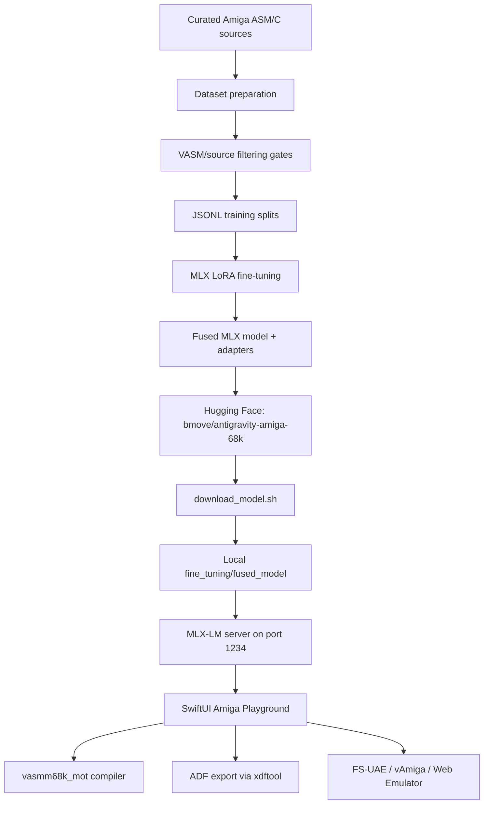

# aMiLa Repository Status

Last refreshed: 2026-05-23

This document records the current state of the `aMiLa` app, model artifacts, validation paths, and repository hygiene after moving generated model files out of GitHub and onto Hugging Face.

---

## Current Summary

- **GitHub branch state**: `master` and `codex/vamiga-cpu-trace-backend` are pushed at `3762a346`.
- **Model hosting**: public Hugging Face model repo at [`bmove/antigravity-amiga-68k`](https://huggingface.co/bmove/antigravity-amiga-68k).
- **Hugging Face model card**: uploaded at Hub commit `27bb299f3ccf3a48476da4891ecf2d64dcff26d3`.
- **Hub metadata**: `private: false`, `library_name: mlx`, `pipeline_tag: text-generation`, tags include `mlx`, `m68k`, `assembly`, `retrocomputing`, `amiga`, `c`, and `vasm`.
- **GitHub artifact hygiene**: `fused_model/`, `adapters/`, optional GGUF files, `server.log`, and the large `corpus_manifest.jsonl` are ignored and removed from reachable Git history.
- **Last app build check**: `xcodebuild -project Amiga/aMiLa/AmigaPlayground/AmigaPlayground.xcodeproj -scheme AmigaPlayground -destination 'platform=macOS' build` succeeded.
- **Known local working-tree noise**: several nested corpus repositories under `Dataset/corpus1/github/...` show local modifications. They are separate corpus working trees and are not part of the app/model documentation changes.

---

## Model Artifact State

The source of truth for the generated model is Hugging Face, not GitHub.

```text
https://huggingface.co/bmove/antigravity-amiga-68k
```

Download locally with:

```bash
cd Amiga/aMiLa/fine_tuning
./download_model.sh
```

This restores the model into:

```text
aMiLa/fine_tuning/fused_model/
```

The app's MLX server controller expects that local directory by default and starts:

```bash
uv run python -m mlx_lm.server --model fused_model --port 1234
```

The repository intentionally ignores:

- `aMiLa/fine_tuning/adapters/`
- `aMiLa/fine_tuning/fused_model/`
- `aMiLa/fine_tuning/*.gguf`
- `aMiLa/fine_tuning/server.log`
- `aMiLa/Dataset/corpus1/corpus_manifest.jsonl`

---

## Application Surface

### SwiftUI App

The current app is organized under:

- `AmigaPlayground/App/`
- `AmigaPlayground/Views/`
- `AmigaPlayground/Services/`
- `AmigaPlayground/AmigaPlaygroundTests/`
- `AmigaPlayground/AmigaPlaygroundUITests/`

Current user-facing workflows include:

- `Cmd+Enter` sends the assistant prompt.
- **Prompt Library** stores, searches, copies, and pastes reusable prompts.
- **New Chat** starts a fresh model conversation.
- **Save Code...** saves the editor source.
- **Indent Code** formats assembly/C source with vasm-oriented indentation.
- **Assemble** switches to the Console tab and runs the assembler.
- **Fix Compile Errors with Assistant** sends compiler logs back to the assistant for targeted correction.
- Code injection asks for confirmation when editor text already exists.
- Injected code includes provenance comments for user, date/time, proposed file name, and prompt.
- The settings window exposes local MLX server controls and a context-window text field/slider.

### Compiler And Export Path

- `CompilerService` runs `vasmm68k_mot` and packages bootable ADF output.
- ADF generation uses `amitools`/`xdftool` from the local Python environment.
- The compiler console records assembler output and error details for repair prompts.

### Emulator Validation

The app includes multiple emulator paths:

- FS-UAE/default emulator launch through `EmulatorService`.
- vAmiga validation support through `VAmigaValidationService`.
- Web emulator view through `WebEmulatorView`.
- TypeScript/Playwright MCP server under `mcp-server-vamigaweb/` for automated browser/emulator workflows.

The TypeScript MCP server was not revalidated during the latest model-history cleanup pass.

---

## Validation State

Recently verified:

```bash
xcodebuild -project Amiga/aMiLa/AmigaPlayground/AmigaPlayground.xcodeproj \
  -scheme AmigaPlayground \
  -destination 'platform=macOS' \
  build
```

Result: build succeeded.

Notes:

- Xcode emitted the normal AppIntents metadata extraction warning because the app has no AppIntents framework dependency.
- The full unit-test suite was not rerun during the most recent documentation refresh.
- Previous focused checks covered MLX server launch command construction and missing-model failure handling.
- The Hugging Face model metadata was verified after publishing the public model card.

Recommended validation before a release:

```bash
xcodebuild -project Amiga/aMiLa/AmigaPlayground/AmigaPlayground.xcodeproj \
  -scheme AmigaPlayground \
  -destination 'platform=macOS' \
  test
```

```bash
cd Amiga/aMiLa/mcp-server-vamigaweb
npm run build
```

---

## Architecture



---

## Dataset And Training Notes

The fine-tuning pipeline lives in `fine_tuning/`.

Current documented training details for the published model:

- Base model: `mlx-community/gemma-4-e4b-it-4bit`
- Fine-tuning method: LoRA followed by fused MLX checkpoint export
- Training length: 1,500 iterations
- Learning rate: `2e-5`
- Published artifact: public Hugging Face model repo with MLX tags and model card

Do not treat generated model outputs as training data unless they are manually reviewed, corrected, and compiler-validated. Keep large generated corpus files and manifests out of Git history.

---

## Repository Hygiene

History cleanup completed:

- Removed large model artifacts from reachable Git history.
- Removed the large `Dataset/corpus1/corpus_manifest.jsonl` blob from reachable Git history.
- Force-updated `master`, `codex/vamiga-cpu-trace-backend`, and tag `v1.5.2` to rewritten history.
- Pushed the rewritten state to GitHub.

Backup from before the rewrite:

```text
/Users/megov/code/GitHub/littlethings/amiga-before-hf-history-rewrite.bundle
```

Keep this bundle only as long as rollback/audit access is useful. It can contain references to the old large history.
