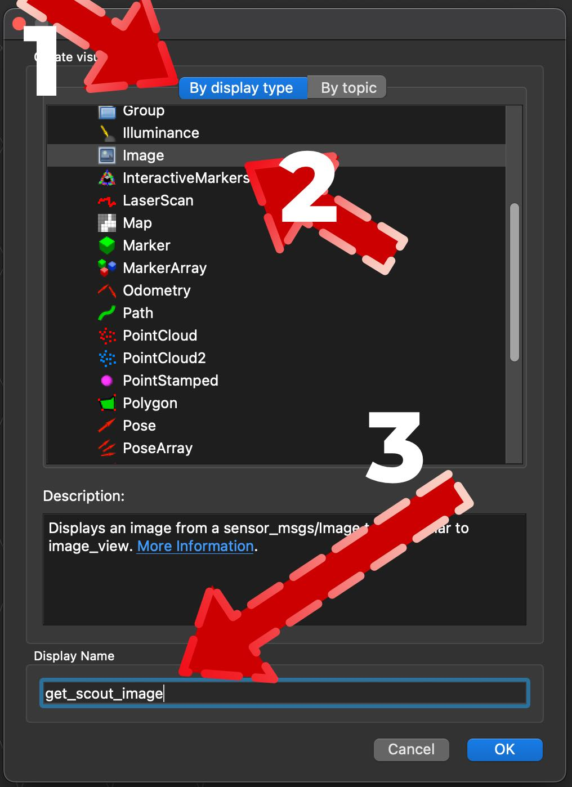
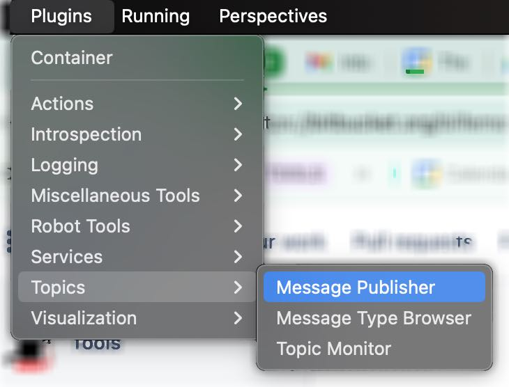
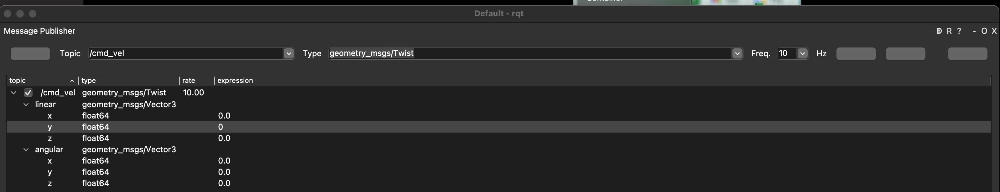

# Spione Project (Scout)

It's a navigational robot that has sensors and a camera, including night vision.

To control Spione we need to [setup](./docs/ros_setup.md) the ROS environment compatible with the hardware.

# About Scout
Below, there are some basics to get everything started.

## Set Wifi
To reset the Wi-Fi, hold the button on the robot's back until you hear a rebooting sound.

then switch to the phone's wifi settings and hook on the scout network. The default password is `r0123456`

## Connect to the robot
* You can find the robot on the network by pining **linaro-alip**.
* `ssh linaro@linaro-alip` with password "**linaro**"

---

# ROS Essentials
Once the node is running you can use rviz to have a visual interface to operate the robot. For example to retrieve the camera feed, one frame at a time, you would take the following steps.

1. launch rviz from terminal
2. click add new display (bottom left or ctrl + N)
3. Configure the message broker

4. set broker topic to `/CoreNode/grey_img` and make sure the checkbox is one. It will live-stream

## Move the robot
To control the robot via a message subscription system, you would do this

1. Launch **rqt** and from the menu select topics > messenger publisher

2. then in **Topic** you would enter `/cmd_vel` which controls the velocity of robot in all three axes. and in **Frequency** enter `10`. Leave **Type** as `geometry_msgs/Twist` 

3. Hit the button "Add new publisher" which is the first on the right side of Hz. Note the buttons look all gray for a UI issue, they work. Mover the mouse over to see the tooltip.

4. now change the values of X (for example) to 0.1 and check the check mark on the top left. Btw, the robot won't stop unless you put zero ^_^

# Code
There's a [gitbub](https://github.com/Pilot-Labs-Dev/Scout-open-source?tab=readme-ov-file) repo from the company that makes the bot. It's all very useful, but you need to run Ubuntu to get started.

I found [this repo](https://github.com/Shell-Company/go-scout/tree/main) to be quite useful to get started, although the code is written in go, you can control the robot with an XBOX controller.

# References
1. [A well detailed view of the robot](https://www.dpin.de/nf/moorebot-scout-as-linux-as-it-can-get/)
2. [How to secure and speed up the bot](https://ukwatte.medium.com/securing-the-moorebot-scout-root-access-proxy-removal-and-best-practices-f478ffd773eb)
3. 