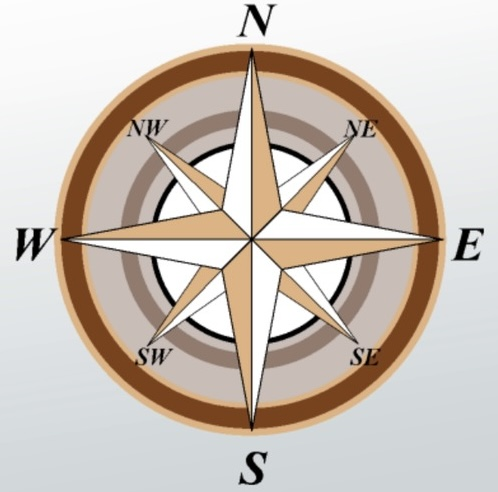

# Spione Project (Scout)

It's a navigational robot that has sensors and a camera, including night vision.

To control Spione we need to [setup](../ROScout/docs/ros_setup.md) the ROS environment compatible with the hardware.

Kick-off camera.py if you want just to see the b/w camera feed.


## Requirements
Just run pip install -r requirements.txt

# Desktop App
If you want to control the robot via joystick or keyboard, then you need to run `snoop.py`

## Movement keys
Below are all supported keys

* W: Move forward
* S: Move backward
* A: Rotate left
* D: Rotate right
* Q: Strafe left
* E: Strafe right
* P: Increase speed
* O: Decrease speed
* Space: Take screenshot
* H: Go home (not implemented yet)
* 9: Turn on light 1 (not implemented yet)
* 0: Turn on light 2 (not implemented yet)
* Esc: Exit program

# Web Service App


**move laterally** (West facing the)

```sh
curl -X POST http://127.0.0.1:5001/move -H "Content-Type: application/json" -d '{"linear_x": 0.1, "angular_z": 0.2}' 
```
**move forward** (South facing the camera)

```sh
curl -X POST http://127.0.0.1:5001/move -H "Content-Type: application/json" -d '{"linear_y": 0.1, "angular_z": 0.2}' 
```

**turn counterclockwise**

```sh
curl -X POST http://127.0.0.1:5001/move -H "Content-Type: application/json" -d '{"linear_z": 0.1, "angular_z": 0.2}'
```
