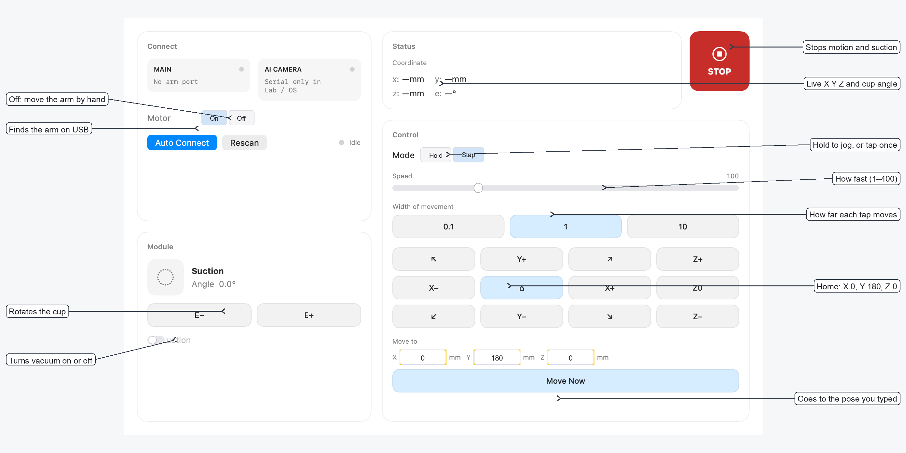

# Joy1

A macOS controller for a HUENIT robotic arm with a suction cup. Connect over USB, jog in X/Y/Z, set home, turn suction on and off, and rotate the cup.



Download the disk image from [Releases](https://github.com/GINNOV/littlethings/releases?q=joy1). Open the `.dmg` and drag **Joy1** to Applications.

See [CHANGELOG.md](CHANGELOG.md) for what changed in each version.

## Requirements

- macOS 15 or later
- Xcode 16 or later
- Arm powered from the **DC IN** port
- Arm **PC** USB-C cable plugged into the Mac

Power the arm before plugging in USB. Do not use the camera USB-C in place of the arm cable.

Official HUENIT Lab (Windows) is documented here: [Installing HUENIT LAB](https://huenit.gitbook.io/huenit-manual-en/huenit-user-manual/how-to-use-huenit-lab/0.-getting-ready/installing-huenit-lab#windows).

## Open the app

```bash
open Joy1.xcodeproj
```

Choose the **Joy1App** scheme and press Run.

Alternatively:

```bash
swift run Joy1App
```

## Connect the arm

1. Power on the arm, then connect USB.
2. If the Main tile has no port, click **Rescan**.
3. Click **Auto Connect** and wait a few seconds.

macOS assigns a new serial device name after unplug/replug. Auto Connect looks up the arm by name (`HUENIT_HUEARM`), not by a fixed path.

**Motor Off** releases the joints so you can move the arm by hand. **Motor On** engages them again.

## Using the pad

See the labeled window above. **STOP** (or Esc) also fires if you switch away from the app.

Let one move finish before starting the next. If the pose is outside reach, the arm will refuse it.

## Safety

- Do not home with Marlin `G28`. This arm has no limit switches and can drive into itself. The app will not send `G28`.
- Power-on / official home is **X 0, Y 180, Z 0**.
- The arm does not move until you connect and press a control.

## Tests

```bash
swift test --skip LiveArmTests
```

That suite does not move hardware. Live tests (not skipped) send small moves to a plugged-in arm and then undo them.
